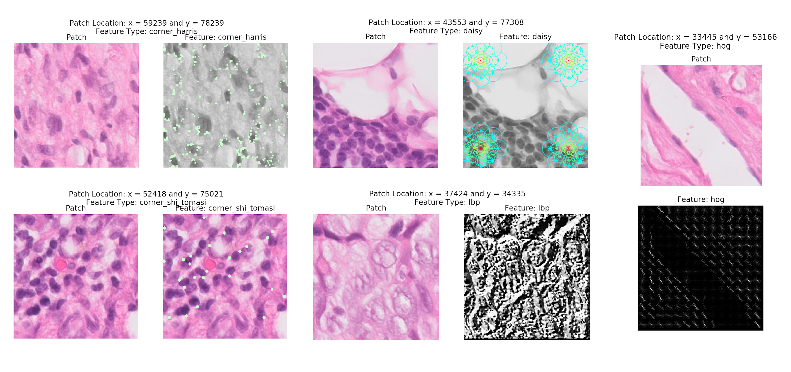
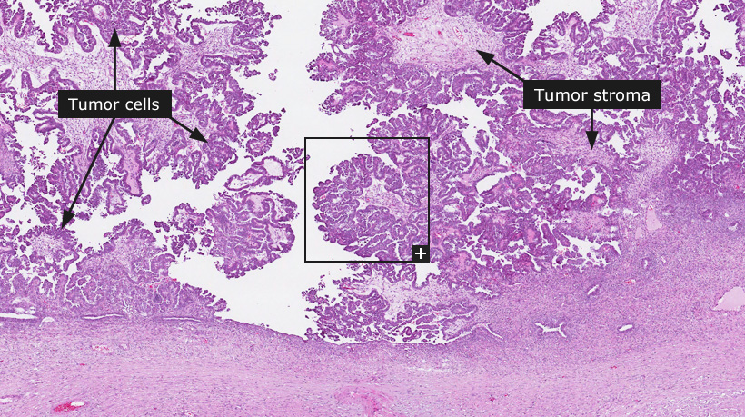
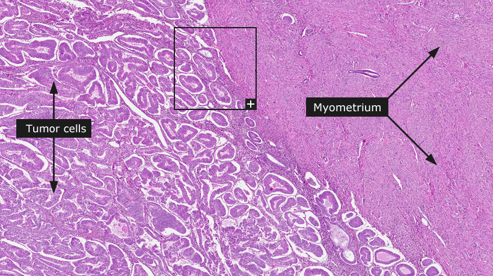
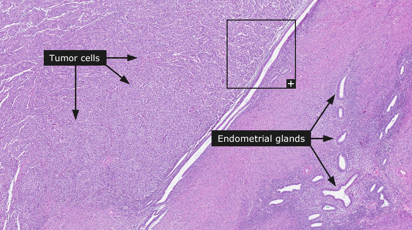

    

        

            <!-- Menu -->
            <ol class="carousel-indicators">
                <li data-target="#carousel" data-slide-to="0" class="active"></li>
                <li data-target="#carousel" data-slide-to="1"></li>
                <li data-target="#carousel" data-slide-to="2"></li>
                <!-- <li data-target="#carousel" data-slide-to="4"></li> -->
                <!-- <li data-target="#carousel" data-slide-to="5"></li> -->
                <!-- <li data-target="#carousel" data-slide-to="6"></li> -->
            </ol>
            

                

                    
                

                

                    
                

                

                    
                

                <!-- 

                    
                
 -->
                <!-- 

                    
                
 -->
                <!-- 

                    
                
  -->
            

            <a class="left carousel-control" href="#carousel" role="button" data-slide="prev">
                
                Previous
            </a>
            <a class="right carousel-control" href="#carousel" role="button" data-slide="next">
                
                Next
            </a>
        

    

    

        

            

                <h1 class="title">
                    <b>Welcome to the AIM Lab at UBC</b>
                </h1>
                

                The <b>Artificial Intelligence in Medicine (AIM) Lab</b>'s research area lies in the interface between computational, engineering and biomedical sciences.
                  
                We are interested in developing machine learning, statistical and signal processing algorithms and software infrastructure to combine various sources of omics and imaging data with major emphasis on discovering novel biological information and biomarkers that can be used for treatment selection in cancer. 
                  
                We have active projects in ovarian, endometrial, prostate, pancreatic, and breast cancers.
                  
                <b>Contact:</b> ... ...
                

            

            

                <a class="twitter-timeline" data-width="350" data-height="748" data-theme="light" href="https://twitter.com/ABashashati?ref_src=twsrc%5Etfw">Tweets by ABashashati</a> 
            

        

    

