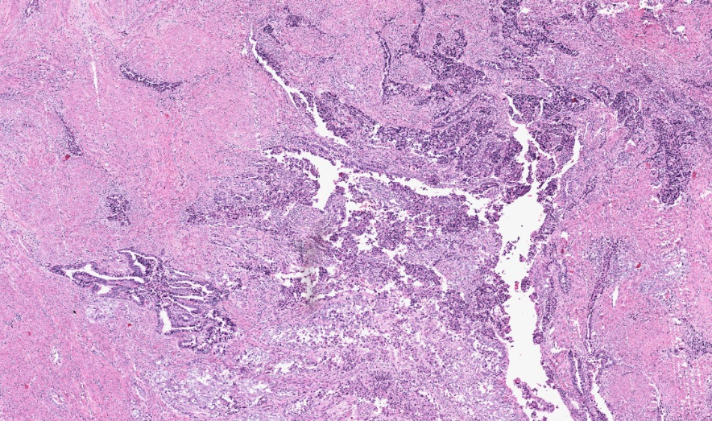
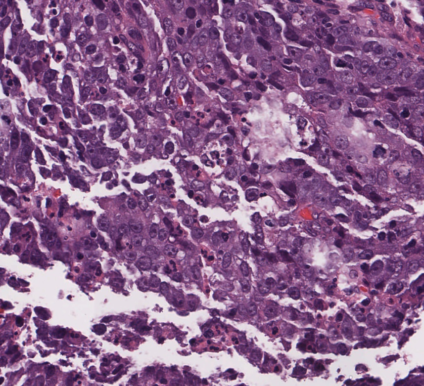
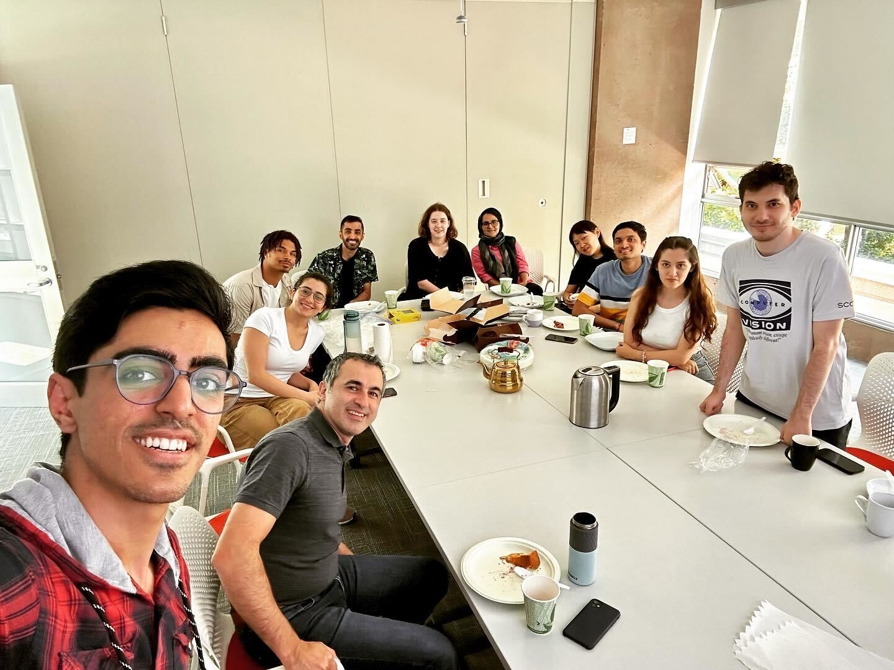

    
    
    
    
    
    
    
    
    
    
    
    
    
    
    

    

        

            

                <h1 class="title"><b>Welcome to AIM Lab</b></h1>
                

                The <b>Artificial Intelligence in Medicine (AIM) Lab</b>'s research area lies in the interface between computation, engineering and biomedicine.
                  
                We are interested in developing machine learning, statistical and signal processing algorithms and software to combine various sources of omics and imaging data with major emphasis on discovering novel biological information and biomarkers that can be used for treatment selection in cancer. 
                  
                We have active projects in ovarian, endometrial, prostate, pancreatic, and breast cancers.
                

            

        

    

    

    

    

        

            
            
        

        

            <a class="twitter-timeline" data-width="350" data-height="1000px" data-theme="light" href="https://twitter.com/ABashashati?ref_src=twsrc%5Etfw">Tweets by ABashashati</a> 
        

    

<!--

    <a class="twitter-timeline" data-width="350" data-height="748" data-theme="light" href="https://twitter.com/ABashashati?ref_src=twsrc%5Etfw">Tweets by ABashashati</a> 

    

        

            <ol class="carousel-indicators">
                <li data-target="#carousel" data-slide-to="0" class="active"></li>
                <li data-target="#carousel" data-slide-to="1"></li>
                <li data-target="#carousel" data-slide-to="2"></li>
            </ol>
            

                

                    
                

                

                    
                

                

                    
                

            

            <a class="left carousel-control" href="#carousel" role="button" data-slide="prev">
                
                Previous
            </a>
            <a class="right carousel-control" href="#carousel" role="button" data-slide="next">
                
                Next
            </a>
        

    

 -->