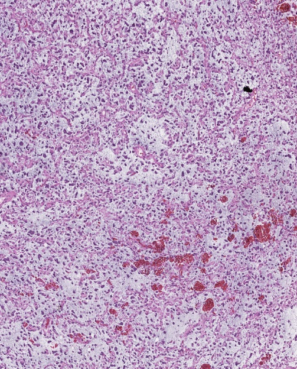
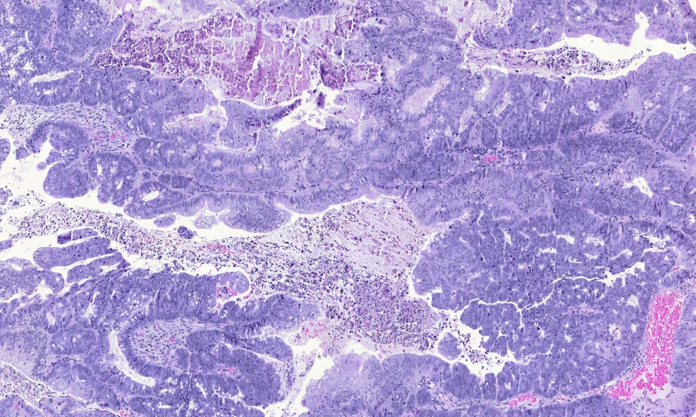
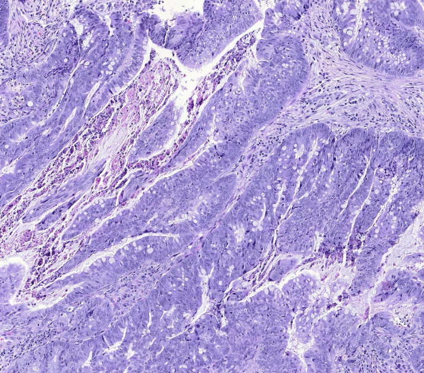
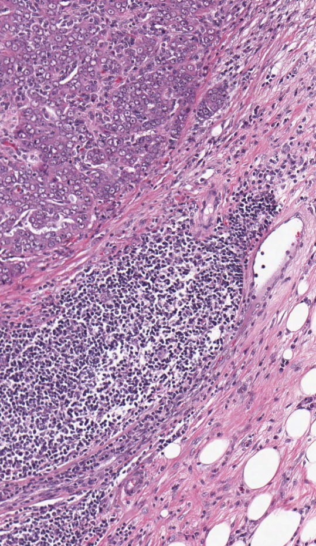
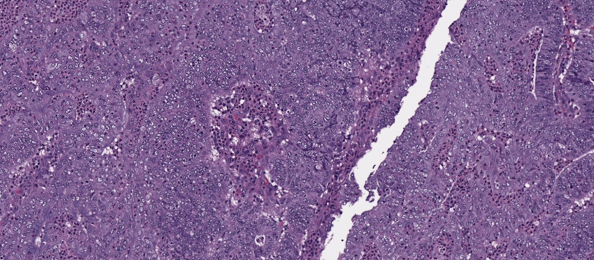

    
    
    
    
    
    
    
    
    
    
    
    
    
    
    



    

    
    
    
        
        
            
                
                    
                
            
        
    
    
    <h4 class="publications-title">Publications</h4>
        

            <ul class="styled-list">
            
                
                
                    
                        
                            
                            <li>
{{ paper.title }}
</li>
                            
                            <li>
<a href="{{ paper.url }}" class="off">{{ paper.title }}</a>
</li>
                            
                        
                    
                
            
            
            </ul>
        

    




