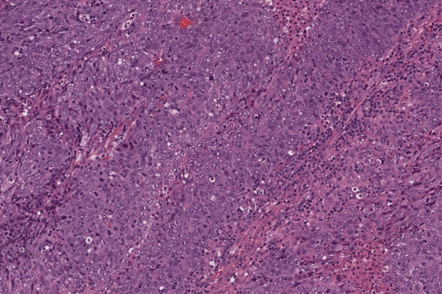

    

        

    

    
    
    
    
    
    
    
    
    
    
    
    
    
    
    

    

        

            

                <h1 class="title"><b>Welcome to AIM Lab at UBC</b></h1>
                

                The <b>Artificial Intelligence in Medicine (AIM) Lab</b>'s research lies in the interface between computation, engineering and biomedicine.
                  
                We're interested in developing machine learning algorithms and software to combine sources of omics and imaging data with an emphasis on discovering novel biological information and biomarkers which can be used for treatment selection in cancer.
                  
                

            

        

    

    
<a href="/projects" class="btn front-btn">➥ Research Highlights 📝</a>
    

    

        

                

                    

                        
                    

                    

                        
                    

                    

                        
                    

                    

                        
                    

                    

                        
                    

                    

                        
                    

                    

                        
                    

                

            

            

            

            

        

    

